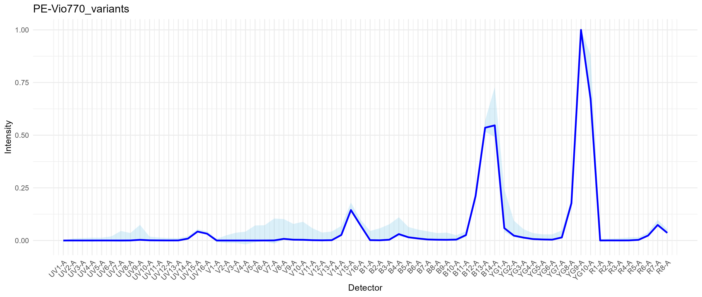

```{r, include = FALSE}
knitr::opts_chunk$set(
  collapse = TRUE,
  comment = "#>"
)
```

Okay, so we're basically going to play some Tetris with your unmixing. You can
also think of this as "theme and variations" if you're musically inclined, or
multiverse unmixing, if you prefer comics.

The aim here is to deal with the inherent variability that exists in the emissions
from the fluorophores. This variability manifests at the level of the cell (or
particle/data point) as spread. Spread is a population-level thing; individual
cells do not have spread, they have exact positions. We get spread in the unmixing
(and compensation in conventional flow) because we have a *distribution* of
outcomes in the spillover/spectra for the fluorophores and we unmix using only a
single (hopefully) best fit spectrum. This means there are data on both sides of
that single best fit (think of it as a median or average for the distribution),
both in the raw data and the unmixed. If there is a mismatch between the single-
colour control used to generate the fluorophore's spectrum and the actual data
in the fully stained sample, this will manifest as a skew in the distribution
of the unmixed data (i.e., unmixing error). These mismatches can occur for a
multitude of reasons, including tandem breakdown, improperly prepared controls,
bead-based controls, low brightness or autofluorescence (AF) contamination of the 
spectrum. The first part of AutoSpectral--getting the optimized single spectra
using `clean.controls` and `get.fluorophore.spectra`, gets you as far as it can
with a single spectrum per fluorophore. This is the next step.

What we are going to do is similar to what we did with the single cell AF 
extraction. We will start by mapping the variation in the single-colour controls
for each fluorophore using a self-organizing map (SOM). 

*Aside: there are multiple ways to do this. The method outlined here uses cleaned*
*data (with intrusive AF removed) from `flow.control`. It is also possible to*
*simply read in each single-colour control and cluster everything that isn't AF*
*and is positive in the unmixed channel. That tends to be messier and slower.*

```{r setup}
library( AutoSpectral )
```

Again, before doing anything, you'll need to run the basic AutoSpectral workflow 
to get the cleaned data.

```{r, eval=FALSE}
asp <- get.autospectral.param( cytometer = "aurora", figures = TRUE )
control.dir <- "./SSC"
control.file <- "fcs_control_file.csv"
flow.control <- define.flow.control( control.dir, control.file, asp )
flow.control <- clean.controls( flow.control, asp )
spectra <- get.fluorophore.spectra( flow.control, asp, use.clean.expr = TRUE, 
                                    title = "Clean Spectra" )
```

Now we are ready to go variant hunting.

```{r, eval=FALSE}
variants <- get.spectral.variants( flow.control, asp, spectra )
```

This outputs a list containing:
1) The thresholds for positivity in each unmixed channel, as determined by the
99.5th percentile on the `AF` sample in `flow.control`. If you refer back to your
`control.file`, this will be whichever sample contains "AF" as the fluorophore.
This should be an unstained cell control matching the single-colour controls in
`control.file` and hence `flow.control`.
2) A named list of matrices, one per fluorophore in `flow.control`. Each matrix
contains up to 100 spectra per fluorophore. This number can be adjusted by
argument `som.dim` to `get.spectral.variants`, which is by default `10`.

The variant spectra are QC'd against the optimized single spectrum for that
fluorophore, as defined in `spectra`. If `spectra` don't all look right, neither
will the variants. The QC is done by cosine similarity, with a default threshold 
set to exclude anything less than 0.98.

It's important to bear in mind that we're only allowing variation within the range
seen in the single-colour control, nothing more.

We get output plots of the variant signatures, which should appear in the `figure_spectral_variants` folder, unless you change the `plot.dir` argument from 
the default `NULL`.

Here's what BUV661 really looks like, at least on the anti-mouse CD19 BUV661 I
used in this experiment:


The dark blue trace is the optimized single spectrum from `spectra`. The light
blue region represents the range of variation across all the variant spectra.
Specifically, the min and max for each channel are being plotted.

Notice that the main variation is in the R1 and R2 detectors, indicative of 
variation in the direct excitation of the red laser-excited acceptor molecule in
BUV661. It's hard to get good information about the structure of the Brilliant
dyes, but they're long polymers and all except for the shortest emission ones
(e.g., BUV395, BV421, BB515 and also BV510) are tandem dyes. BUV661 is probably
a tandem of BUV395 and something like Cy5. So, what we are seeing is variation
in the ratio of direct Cy5 excitation by the 561nm laser to excitation of BUV395
by the 355nm laser. There are a lot of reasons why this could be happening. One 
explanation that I consider to be likely is that we have a distribution of species
of BUV661 in the conjugated antibody, either due to production variation (not so
likely) or tandem breakdown (more likely). When we stain our cells, the
distribution of conjugates on any given cell will give a certain result (think of
80 intact molecules and 20 somewhat broken ones on cell A, and perhaps 85:15 on 
cell B), which will result in a distribution at the population level. There's also
electronic noise and measurement error in the mix. Anyway, we get some cells with
more red emission and some with less, which will create variability in amount of
red signal from BUV661. This means that if we put a fluorophore in our unmixing
that uses R1 and/or R2 heavily, say APC, we will observe variability in the cells
that are positive for BUV661 with respect to APC. Hence, spillover spread.

Here's PE-Vio770 (anti-ACSA-2), which is essentially PE-Cy7. See that there's a
wide light blue region around YG1, which is where the base donor PE molecule emits.
This means we have some tandem breakdown and that there is a range of species in
the vial. The variation in the mid-UV, mid-violet and narrow-blue is AF.



Okay, now we're ready to unmix with per-cell fluorophore optimization.

This is where we start Tetrising.

We are going to try to figure out which of these variants is the best "fit" for
each cell in the data. We do this by trying to fill in the little gaps, the 
mismatch, in between the raw data and the prediction from the unmixing model.
This gap is call the residual, which is the part of the data that cannot be 
explained by the model. We want the model to be as good as possible, which means
minimizing that gap. One way of thinking of the unmixing is that we are trying to
squeeze the spectra into the raw data. We can multiply them up and down to scale
them, but we don't normally get to change the shapes at all. With the variants,
we have options, all of which are very, very similar, but that small flex allows
us to fit the shapes in better.

The most accurate way of doing this would be to test not only each variant for
each cell, but to test each *combination* of variants, probably in an iterative
refinement. Since that would increase at the rate of n.variants^n.fluorophores,
it is currently prohibitive to do so. Note that this does not even begin to deal
with variation outside the range of what is seen in the single-stained controls.
All of this to say, there is probably a better way to do this than a BitCoin-like
brute force method. What AutoSpectral currently does is a close approximation by
screening all variants simultaneously per cell based on the difference between
each variant and the single optimized spectrum. There are other, faster ways of
determining the variation in each cell's spectral signatures, but the other
options I have tried result in an increase in unmixing-dependent spread due to
the carryover of noise.

Anyway, this is going to take a while. A faster version is in progress. Be sure
that you have the fast BLAS and LAPACK installed. Please reach out if you have
suggestions for faster implementation (I'm not a computer scientist).


```{r, eval=FALSE}
fully.stained.dir <- "./Fully stained"

unmix.fcs( fcs.file = file.path( fully.stained.dir, "C3 Lung_GFP_003_Samples.fcs" ),
           spectra = spectra,
           asp = asp,
           flow.control = flow.control,
           method = "AutoSpectral",
           af.spectra = lung.af,
           spectra.variants = variants )
```

This will use OLS to find the optimal AF per cell. To use WLS, set 
`weighted = TRUE`.

Alteratively, we can call `method = "Automatic"`, which is the default. This takes
care of the decision making for AF extraction and weighting automatically. So,
if you provide `af.spectra`, per-cell AF extraction will be done. Weighting will
be used if the data come from the ID7000, the FACSDiscoverS8 or the FACSDiscoverA8,
attempting to replicate the methodology used on those systems. For explicit
control, call `method = "AutoSpectral"` as above, and set the arguments.

```{r, eval=FALSE}
unmix.fcs( file.path( fully.stained.dir, "C3 Lung_GFP_003_Samples.fcs" ),
           spectra,
           asp,
           flow.control,
           af.spectra = lung.af,
           file.suffix = "perCellOptimized" )
```

Unmixed FCS files will appear in folder `./autospectral_unmixed`.

Add a `file.suffix` argument if you want a tag on the FCS file's name to
differentiate it from other versions.


