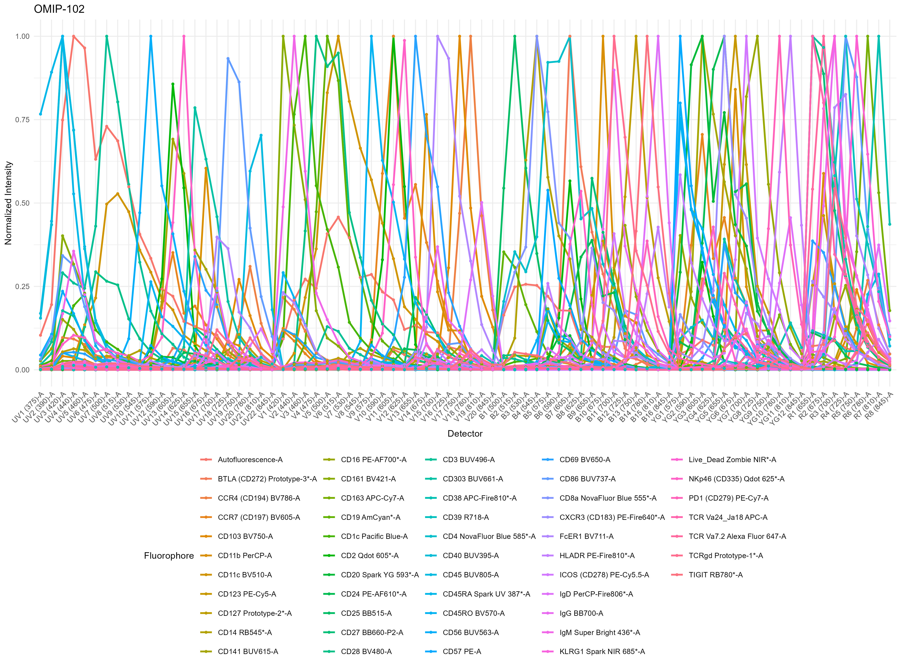

```{r, include = FALSE}
knitr::opts_chunk$set(
  collapse = TRUE,
  comment = "#>"
)
```

In this article, let's look at a couple of the functions that AutoSpectral offers for plotting your spectra and data.

```{r setup}
library( AutoSpectral )
```

Let's load in some spectra, here from OMIP-102.
```{r, eval=FALSE}
s8.fcs <- "~/AutoSpectral_data/S8_data/BP0323502_1.fcs"
chorus.spectra <- read.bd.spectra( s8.fcs )
chorus.spectra[ 1:6, 1:5 ]
```
The basic tools are `spectral.trace`, which gives line graphs of the spectra for each fluorophore in the matrix, and `spectral.heatmap`, which gives the same information as a heatmap.

```{r, eval=FALSE}
spectral.heatmap( chorus.spectra, title = "OMIP-102", color.palette = "mako",
                  save = FALSE, show.legend = FALSE )
```

```{r, eval=FALSE}
spectral.trace( chorus.spectra, title = "OMIP-102", split.lasers = FALSE,
                save = FALSE, show.legend = FALSE )
```
This works a lot better if you save it. Then you can add the legend in so you can see which fluorophore is which. It's also better to split it up by laser:



We can create a cosine similarity matrix plot in one of two ways.

```{r, eval=FALSE}
cosine.similarity.plot( chorus.spectra, save = FALSE )
```
This way generates a square matrix (duplicated info across the diagonal) showing the cosine similarity values between each pair. The mixing matrix condition number is listed below for reference.

We can also call `create.heatmap` which is a more general purpose function that's more useful for things like plotting the "hotspot matrix". This gives you a bit more control, but there are aspects that still need some work (sorry).

For this, let's look at a small subset of the matrix (the first five fluorophores). We'll calculate the cosine similarity matrix by calling `cosine.similarity` (hint, do the same with other functions to see other aspects of your data).

```{r, eval=FALSE}
matrix.subset <- chorus.spectra[ 1:5, ]
small.cosine.matrix <- cosine.similarity( matrix.subset )
create.heatmap( small.cosine.matrix, number.labels = TRUE,
                color.palette = "turbo",
                save = FALSE )
```

Let's change a couple of things.
```{r, eval=FALSE}
create.heatmap( small.cosine.matrix, 
                number.labels = TRUE,
                legend.label = "Cosine Similarity",
                triangular = TRUE,
                color.palette = "mako",
                save = FALSE )
```

We have the option to pass min and max scale settings, which is useful for comparing multiple sets of data on the same scale (not really relevant in this case, though).
```{r, eval=FALSE}
create.heatmap( small.cosine.matrix, 
                number.labels = FALSE,
                legend.label = "Cosine Similarity",
                triangular = TRUE,
                fixed.scale = TRUE,
                scale.min = 0, scale.max = 2,
                color.palette = "plasma",
                save = FALSE )
```

Finally, we can make x-y biplots of FCS data, which can be useful for quickly checking what's going on. To be fair, this is where programs with graphical user interfaces like FlowJo, FCS Express, SpectroFlo, etc. really excel, so doing it here is in R not really the best option.

To start, we can load in an FCS file--let's use the OMIP-102 file--and we need to call up the AutoSpectral parameter list because I haven't gotten around to removing that dependency yet.

```{r, eval=FALSE}
asp <- get.autospectral.param( cytometer = "s8" )
omip102.file <- "~/AutoSpectral_data/S8_data/BP0323502_1.fcs"
omip102.ff <- suppressWarnings( flowCore::read.FCS( omip102.file, 
                                          transformation = FALSE,
                                          truncate_max_range = FALSE,
                                          emptyValue = FALSE ) )
omip102.data <- flowCore::exprs( omip102.ff )
colnames( omip102.data )
```

Now we can call the plotting function:
```{r, eval=FALSE}
create.biplot( omip102.data,
               x.dim = "BUV395-A", y.dim = "BUV496-A",
               asp, save = FALSE )
```
Note that this is currently ungated. You can play around with the automated gating functions in AutoSpectral if you want (these work okay with OMIP-102), but you'll be better off using a graphical interface.

We can change the plot limits, color palette, etc.
I haven't implemented a rainbow palette like FlowJo has yet.
```{r, eval=FALSE}
create.biplot( omip102.data,
               x.dim = "BUV395-A", y.dim = "BUV496-A",
               x.min = -15000, x.max = 1e6,
               color.palette = "inferno",
               asp, save = FALSE )
```
Currently, there's a limit on the amount of compression that can be applied using the biexponential scale. I'll fix that later. You can, however, apply less compression around zero.

```{r, eval=FALSE}
create.biplot( omip102.data,
               x.dim = "BUV395-A", y.dim = "BUV496-A",
               x.min = -15000, x.max = 1e6,
               y.width.basis = -250,
               color.palette = "inferno",
               asp, save = FALSE )
```

The maximum number of points to be plotted is capped by default at 1e5 to speed up the plotting. Setting an arbitrarily big number will plot everything.

```{r, eval=FALSE}
create.biplot( omip102.data,
               x.dim = "BUV395-A", y.dim = "BUV496-A",
               x.min = -15000, x.max = 1e6,
               y.max = 2e6,
               max.points = 1e8,
               color.palette = "viridis",
               asp, save = FALSE )
```


