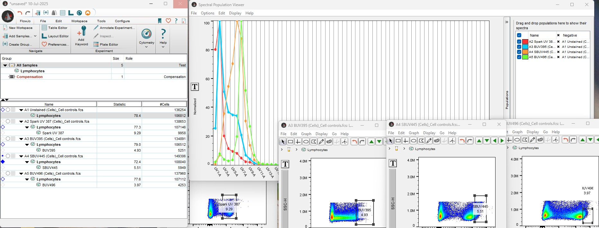
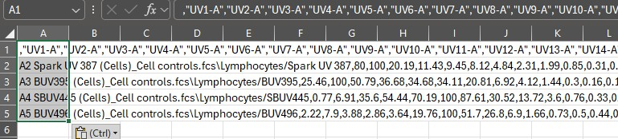
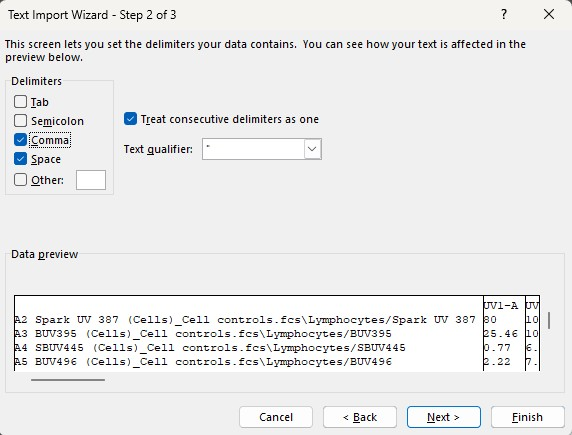
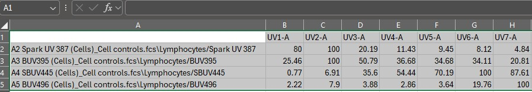

```{r setup, include=FALSE}
knitr::opts_chunk$set(echo = TRUE)
```

You may wish to return to an experiment to unmix it again. If you want to create
new spectra, perhaps trying a new cleaning method or changing the gating, start
as you would normally. If however, all you want to do is re-unmix or change the
parameter names on the created FCS files, you don't need to go through the whole
process of loading the single-stained control files, gating, cleaning and 
extracting the spectra. In this article, we're going to look at the short, quick
workflow to allow you to return to a previous AutoSpectral run and go straight 
to unmixing. Note that this workflow can be adapted to use spectral matrices
obtained using other methods, such as FlowJo or SpectroFlo, if you prefer. Some
details on that at the end.

We're going to start, as always, by loading AutoSpectral and setting the parameters
for our cytometer. We also need the folder containing the single-stained controls
and the control file spreadsheet. You should already have all of this.

```{r autospectral}
library(AutoSpectral)
asp <- get.autospectral.param(cytometer = "id7000")
control.dir <- "path_to_my_single_stained_controls"
control.def.file <- "fcs_control_file.csv"
```

Then, we create a shell of the `flow.control` list, mostly to provide us with
the channels we'll use for spectral unmixing.

```{r, eval=FALSE}
flow.control <- reload.flow.control(control.dir, control.def.file, asp)
```

We also need to load in our spectra. If we've run AutoSpectral already, these
will be in `./table_spectra` and will, by default, be called something like
"Initial autospectral spectra.csv". We need to read this into R, making sure to
set the names of the fluorophores correctly:

```{r, eval=FALSE}
spectra.file <- "./table_spectra/Initial autospectral spectra.csv"
spectral.matrix <- as.matrix(read.csv(spectra.file, check.names = FALSE,
                                       row.names = 1))
```

What we're doing here is reading in the csv file, which R coerces to a data.frame.
To prevent the fluorophore and detector names from changing, `check.names` is set
to `FALSE`. The `row.names` argument being set to `1` means the first column in
the csv file will become the rownames of the data in R, which is what we want
because the fluorophore names are in that column. A matrix is faster to work 
with, so we turn it into a matrix.

Now, we have all the information we need to unmix our files. We just need to
point AutoSpectral to the folder containing the FCS files we want to unmix and
tell it how we want to perform the unmixing. Here, we're using weighted least
squares by calling `WLS`.

```{r, eval=FALSE}
sample.dir <- "./Raw samples"
unmix.folder( sample.dir, spectral.matrix, asp, flow.control, method = "WLS" )
```

The unmixed FCS files go to the "AutoSpectral_unmixed" folder in your current
working directory, or, if you prefer, to the folder of your choice if you
specify this to unmix.folder as an argument to `output.dir`.


You can also load a spectral matrix you've prepared using something else. For
instance, we can spectra that we isolate in FlowJo or directly pull them from
the SpectroFlo Experiment file. Why would you want to do this? Well, perhaps
you're struggling with AutoSpectral and know you can get decent spectra from your
beads in FlowJo or know that you've already gotten clean spectra on your
cytometer's software. Maybe you'd just like to try out different unmixing approaches,
perhaps checking the per-cell autofluorescence extraction. Let's look at how to
do this.

You'll need to run the steps above up to the point of loading in the spectra. In
other words, you need to create `asp`, `control.dir`, `control.def.file` and
`flow.control`. Hopefully this can be simplified in the future.

Now, to load in a matrix from FlowJo, first create it using the Spectral
Population Viewer tool. Use negative and positive gating, as appropriate for your
sample.
https://docs.flowjo.com/flowjo/advanced-features/spectral-populations/





To get the spectral (spillover) data, first set the Spectral Viewer Plot to
normalized values by going to Options/Normalized/Only Positive Values. Then,
right click on the plot and "Copy Content". Paste this into your favorite
spreadsheet program (e.g., Excel), which will probably give you a mess like this:




To reformat it, click on the clipboard icon and select "Use Text Import Wizard".
Select "delimited", hit "Next", then select "Comma" and finally "Finish".







The spectra are normalized to 100 in FlowJo, whereas in AutoSpectral and in 
SpectroFlo everything is normalized to 1. This doesn't matter as long as all
the spillover rows are normalized to the same maximum value. If you start
combining data from different sources with different normalization schemes,
re-normalize before unmixing or the normalization will carry over into the 
scaling of the unmixed data, which you don't want.

You should probably rename the stuff in column A to be the names of the
fluorophores, as this is what you'll be importing into R.

Save the spreadsheet as a CSV file. Then you can read it into R as follows:

```{r, eval=FALSE}
spectra.file <- "~/AutoSpectral_data/AlternativeMatrices/FlowJo_Spectra.csv"
spectral.matrix <- as.matrix(read.csv(spectra.file, check.names = FALSE,
                                       row.names = 1))
```


Pulling the spillover matrix directly from your SpectroFlo experiment is also
possible, provided you've gone through the unmixing process in SpectroFlo. This
should work whether you've used controls as part of a Reference Group or used
stored controls from the library. In other words, we can obtain the spillover
matrix that was used for the unmixing in SpectroFlo.

List the name and location of your experiment file. The function will extract
the spillover matrix both to an object in R as well as writing a copy to disk
as a CSV file. Define where you'd like the CSV file to end up as `output.dir`.

```{r, eval=FALSE}
spectroflo.expt <- "~/AutoSpectral_data/AlternativeMatrices/20240620 Spectral Symposium-poor cell unmixed.Expt"
output.dir <- "./table_spectra"
spectral.matrix <- read.spectroflo.expt(spectroflo.expt, output.dir)
```


